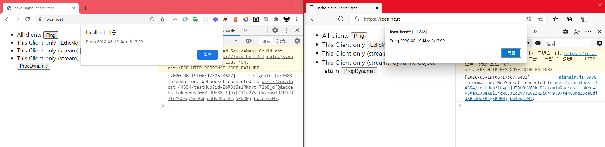
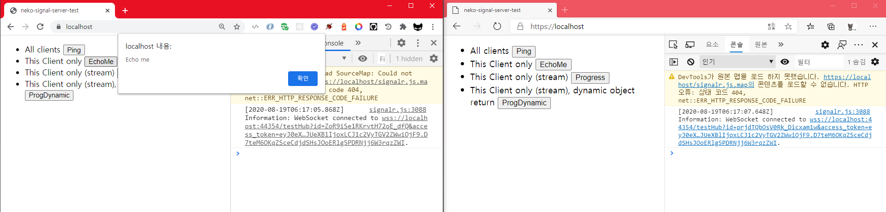
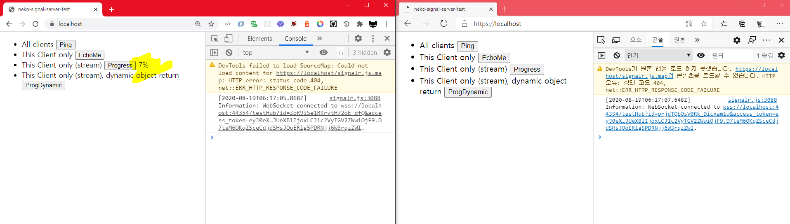
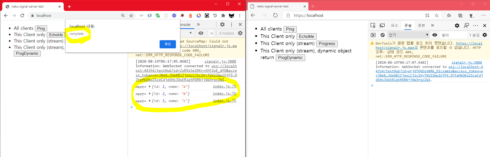

# neko-signalr-clientserver
FE: Html+Javascript, BE: Asp.net core 3.1 + SignalR

## Broadcast

## This client only

## Stream subscribe (progress with int return)

## Stream subscribe (progress with json return)

